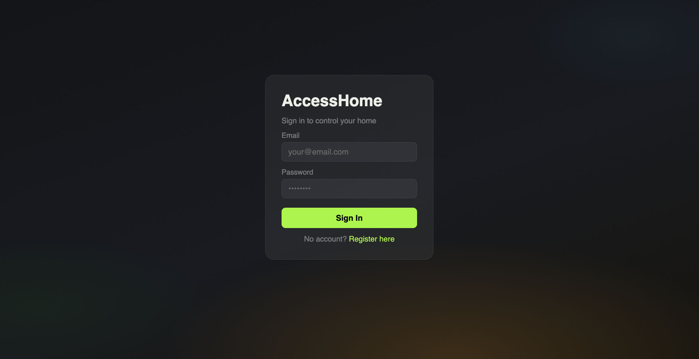
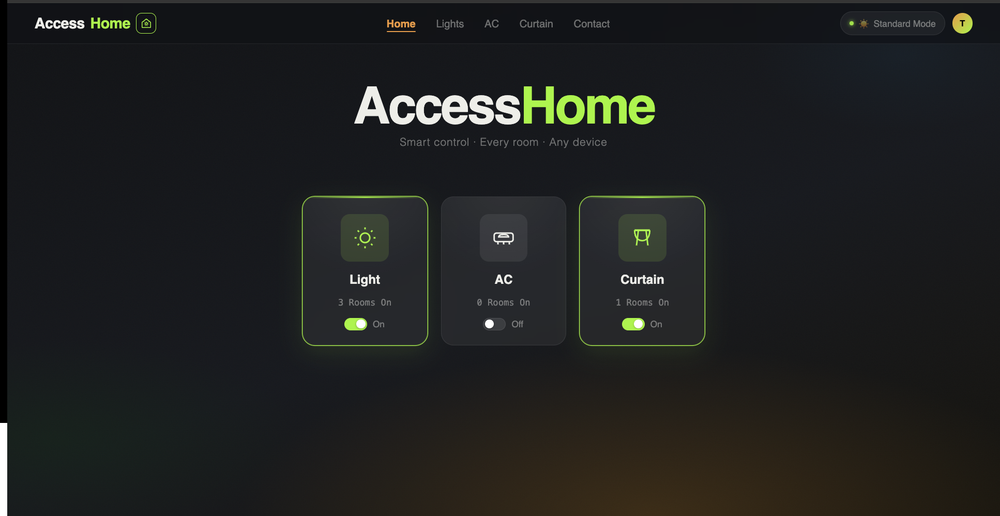
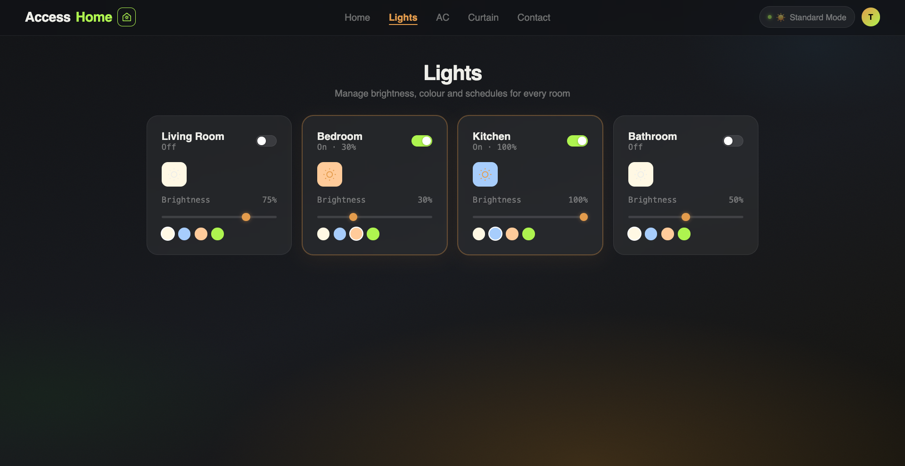
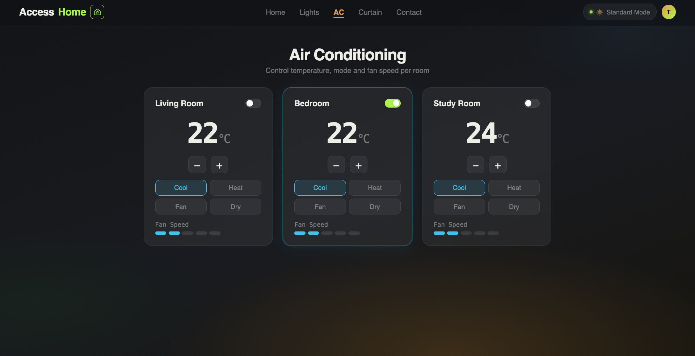
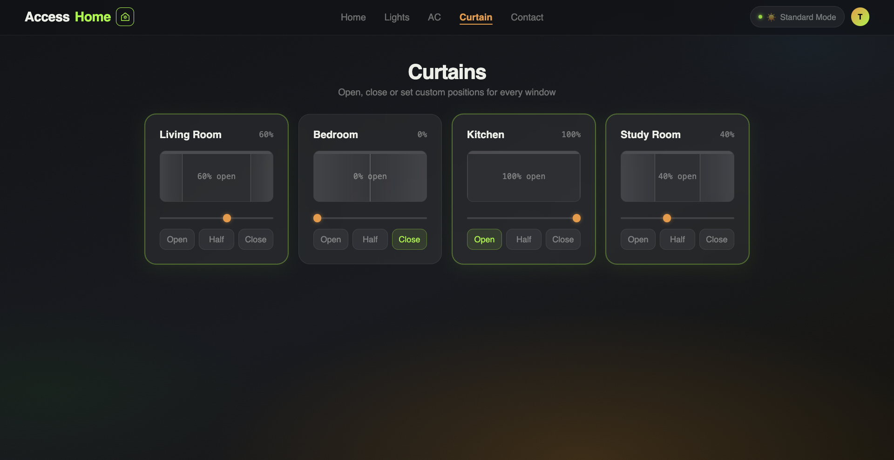
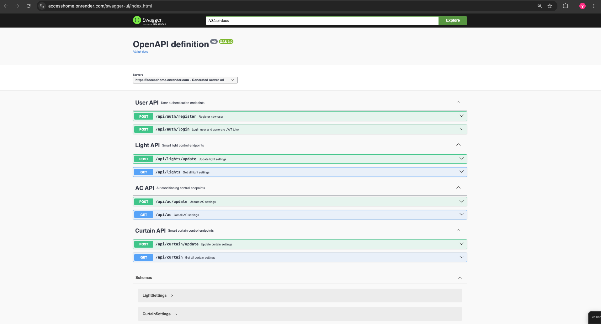

# AccessHome

AccessHome is an accessible smart home full-stack web application that allows users to remotely control home devices such as lights, curtains, and air conditioning.


## Live Demo

Frontend:
https://accesshome.vercel.app

Swagger:
https://accesshome.onrender.com/swagger-ui/index.html
---

## Features

- User registration and login
- JWT authentication
- Smart light control
- Smart curtain control
- Air conditioner control
- Multi-language support (EN / PL / FR / ZH)
- Responsive UI
- Accessibility-focused design
- Swagger API documentation

---

## Tech Stack

### Frontend
- React
- Vite
- CSS

### Backend
- Spring Boot
- Spring Security
- JWT
- REST API
- JPA / Hibernate

### Database
- PostgreSQL

### Deployment
- Vercel
- Render
- Docker
- GitHub

---

## System Architecture

```text
Frontend (React)
↓ REST API
Backend (Spring Boot)
↓
PostgreSQL
```

---

## Local Setup

### Frontend

```bash
npm install
npm run dev
```

### Backend

```bash
mvn spring-boot:run
```

---

## API Documentation

Swagger:

https://accesshome.onrender.com/swagger-ui/index.html

---

## Screenshots

- Login page


- Dashboard


- Device control page






- Swagger API

---

## Project Status

Phase 1: UI Design  
Phase 2: Backend Development  
Phase 3: Deployment  
Phase 4: Testing & Optimization

---

## Author

Yuting